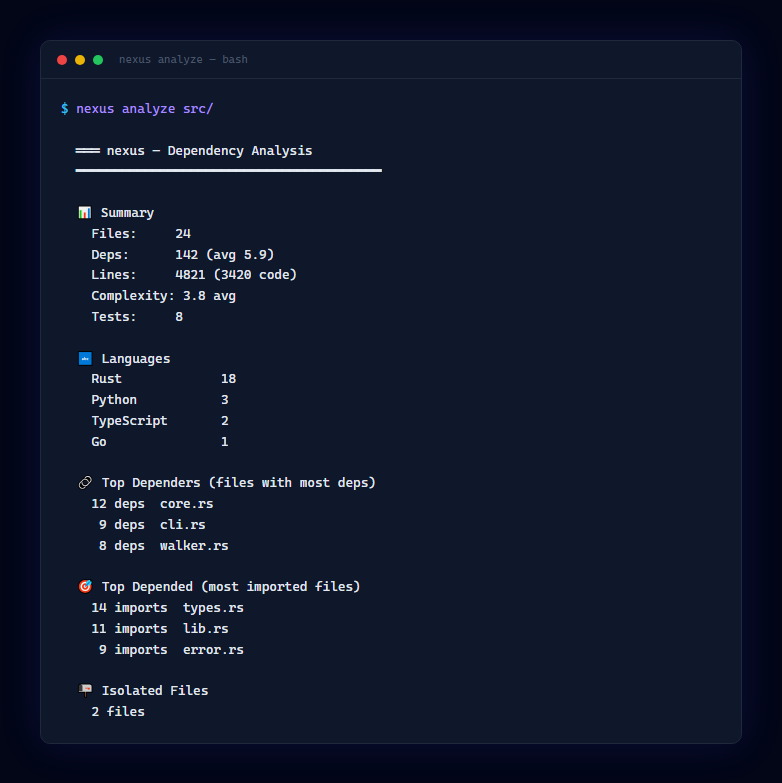
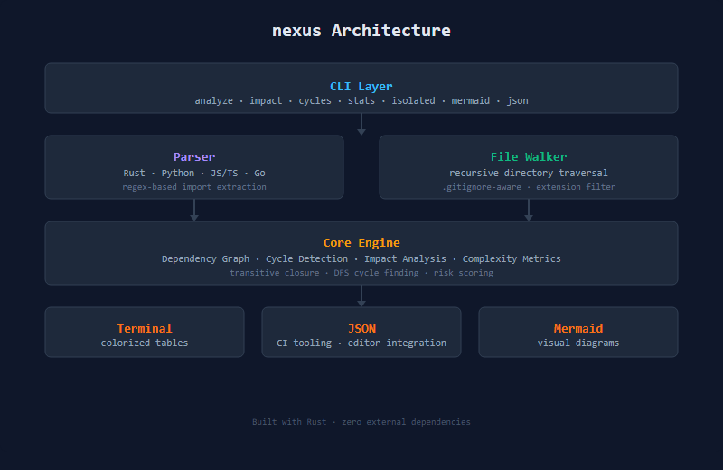

<div align="center">
  
  <h1>nexus</h1>
  <p><strong>Codebase Dependency Analyzer &amp; Visualizer</strong></p>
</div>

<div align="center">

[](#)
[](#)
[](#)
[](https://github.com/ZachDreamZ/nexus/actions/workflows/ci.yml)

</div>

<p align="center">
  
</p>

nexus analyzes your codebase's dependency structure — who imports what, circular dependencies, impact zones, and everything you need to understand the architecture of any project.

## Features

- **Dependency Graph** — Extract import graphs from Rust, Python, JavaScript/TypeScript, and Go
- **Circular Detection** — Find circular dependencies with full path reporting
- **Impact Analysis** — Show the blast radius of changing a file (transitive dependents)
- **File Isolation** — Detect files with no dependencies and no dependents
- **Complexity Metrics** — Estimate complexity from control flow, nesting depth, and token variety
- **Language Breakdown** — See your codebase composition by language
- **Multiple Outputs** — Terminal table, JSON, and Mermaid.js diagrams
- **Zero Dependencies** — Pure standard library, nothing to install but `cargo`

## Install

```bash
cargo install --git https://github.com/ZachDreamZ/nexus
```

Or build from source:

```bash
git clone https://github.com/ZachDreamZ/nexus.git
cd nexus
cargo build --release
./target/release/nexus --help
```

## Quick Start

```bash
# Analyze current directory
nexus analyze

# Analyze a specific directory
nexus analyze src/

# Find circular dependencies
nexus cycles

# Show summary stats only
nexus stats

# Find isolated files
nexus isolated

# Impact analysis (what breaks if I change this file?)
nexus impact src/core/lib.rs

# Export as Mermaid diagram
nexus mermaid src/ > deps.mmd

# Export as JSON
nexus json src/ > analysis.json
```

## Commands

| Command | Description |
|---------|-------------|
| `analyze` | Full dependency analysis with terminal output |
| `impact` | Show blast radius of changing specific files |
| `cycles` | Find and report circular dependencies |
| `stats` | Quick summary statistics |
| `isolated` | Find files with no connections |
| `mermaid` | Export graph as Mermaid.js diagram |
| `json` | Export full analysis as JSON |

## Options

| Option | Description |
|--------|-------------|
| `--exclude PAT` | Exclude paths containing PAT (repeatable) |
| `--depth N` | Maximum directory depth |
| `--ext EXT` | Include file extension (repeatable) |

## Architecture



## Supported Languages

| Language | Import Detection |
|----------|-----------------|
| Rust | `use`, `pub use`, `mod` |
| Python | `import`, `from ... import` |
| JavaScript | `import`, `require()` |
| TypeScript | `import`, `require()` |
| Go | `import` (single and grouped) |

## Examples

### Analyze a Rust workspace

```bash
$ nexus analyze
```

### Output as JSON for CI tooling

```bash
$ nexus json --exclude target --exclude node_modules > analysis.json
```

### Generate a Mermaid diagram

```bash
$ nexus mermaid src/ > deps.mmd
$ # Then render with: npx @mermaid-js/mermaid-cli deps.mmd
```

## License

MIT
